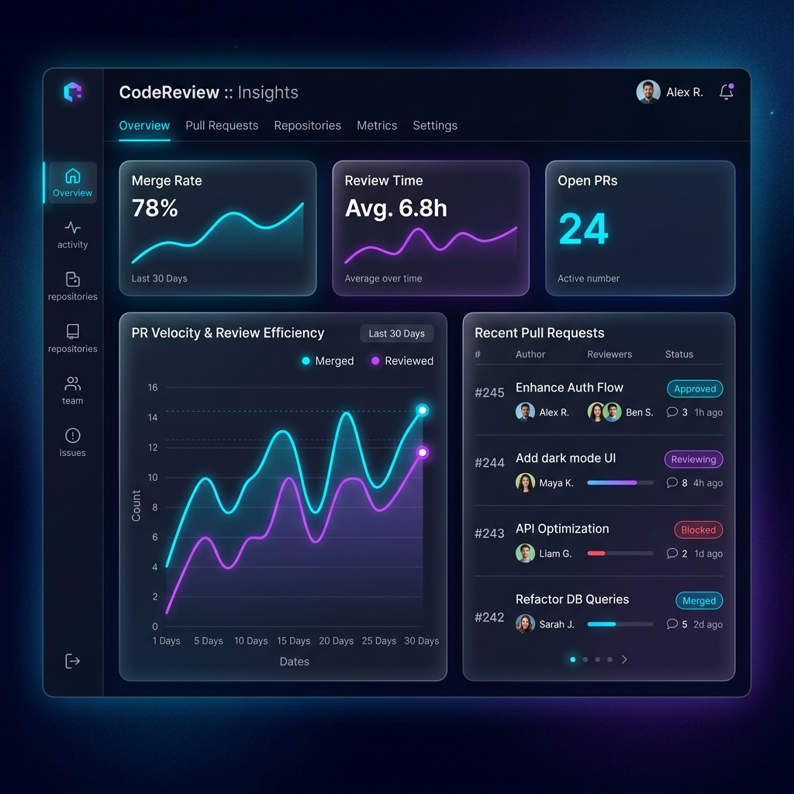
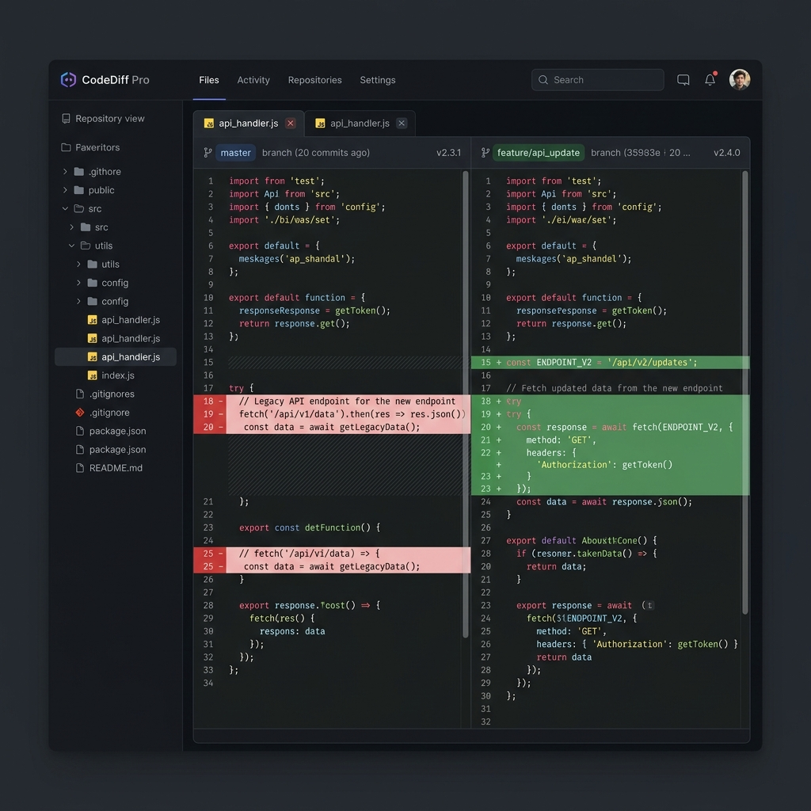

# AI Code Review Agent 🚀


An enterprise-grade, high-performance automated code review agent that leverages multi-LLM architectures (Gemini, Claude, GPT-4) to provide deep, contextual feedback on pull requests. Reduces manual review time and catches bugs before they reach production.

## 📸 Screenshots

| Dashboard | Code Review Interface |
| :---: | :---: |
|  |  |

---

## ⚡ Features

- **Multi-LLM Strategy**: Automatically selects the best model for the task (Gemini for speed, Claude/GPT-4 for complex reasoning) via OpenRouter.
- **Deep Contextual Reviews**: Analyzes diffs in the context of the whole repository architecture.
- **Role-Based Access Control**: Secure login, User profiles, and an Admin dashboard.
- **Dynamic Metrics Dashboard**: Real-time insights mapping bugs prevented, languages analyzed, and team metrics.
- **Beautiful UI**: Modern, glassmorphism-inspired design meticulously crafted with React and Tailwind CSS.
- **Containerized Deployment**: Full docker-compose setup for easy orchestration of the FastAPI backend and Postgres DB.

---

## 🛠️ Installation Guide

### Prerequisites
- Docker & Docker Compose
- Node.js (v18+)
- Python 3.11+
- [OpenRouter](https://openrouter.ai/) API Key

### Local Development Setup

1. **Clone the repository:**
   ```bash
   git clone https://github.com/your-username/ai-code-review-agent.git
   cd ai-code-review-agent
   ```

2. **Backend Setup:**
   ```bash
   cd backend
   cp .env.example .env
   # Add your OPENROUTER_API_KEY and DATABASE_URL in .env
   
   python -m venv .venv
   source .venv/bin/activate  # On Windows: .venv\Scripts\activate
   pip install -r requirements.txt
   
   alembic upgrade head
   uvicorn app.main:app --reload --port 8000
   ```

3. **Frontend Setup:**
   ```bash
   cd ../frontend
   cp .env.example .env
   
   npm install
   npm run dev
   ```

---

## 🛳️ Deployment Guide

We recommend using Docker Compose for a unified deployment, or Render for serverless deployment.

### Docker Compose
```bash
docker-compose up -d --build
```
This automatically provisions PostgreSQL, applies Alembic migrations, and spins up the FastAPI backend and React frontend (served via Nginx).

### Render (Cloud)
A `render.yaml` file is provided in the repository root for one-click Infrastructure-as-Code deployment. Connect your repository to Render to automatically provision the Web Service (FastAPI), Static Site (Vite), and PostgreSQL instance.

---

## 📚 API Documentation

Once the backend is running, FastAPI automatically generates interactive OpenAPI documentation.
Navigate to: `http://localhost:8000/docs`

### Core Endpoints:
- `POST /api/auth/register` - Register a new user
- `POST /api/auth/login` - Obtain JWT tokens
- `POST /api/reviews/analyze` - Submit a Git patch for AI analysis
- `GET /api/reviews` - Fetch review history for user

---

## 🤝 Contributing
Contributions are welcome. Please open an issue or submit a Pull Request.

## 📝 License
This project is licensed under the MIT License - see the LICENSE file for details.
