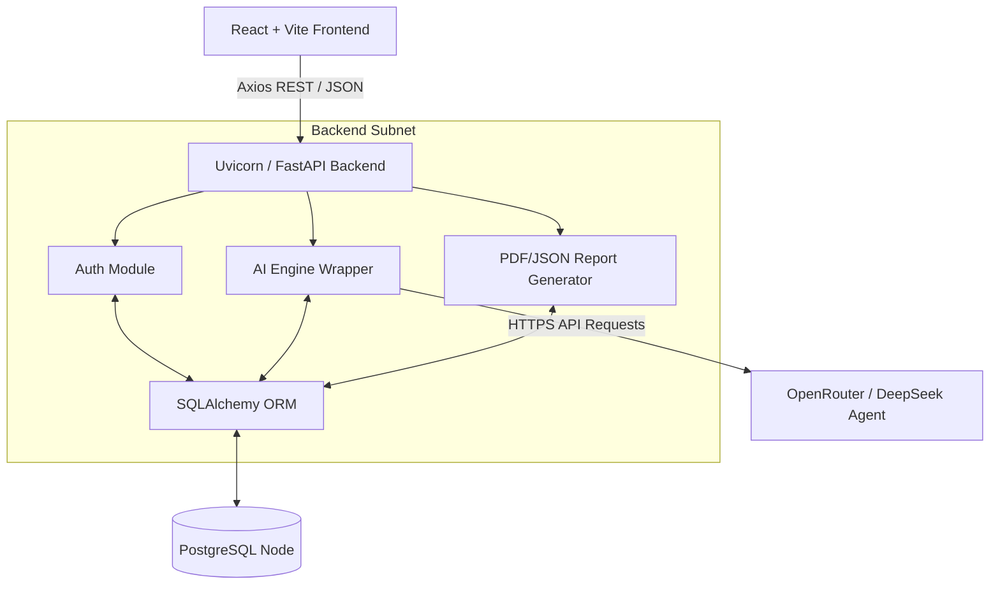
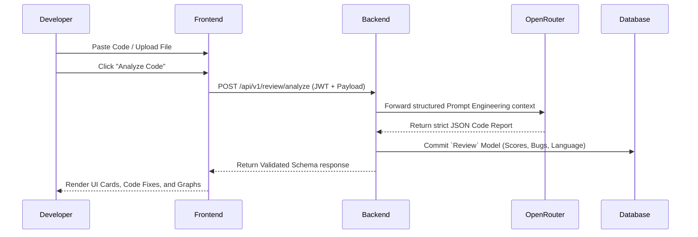
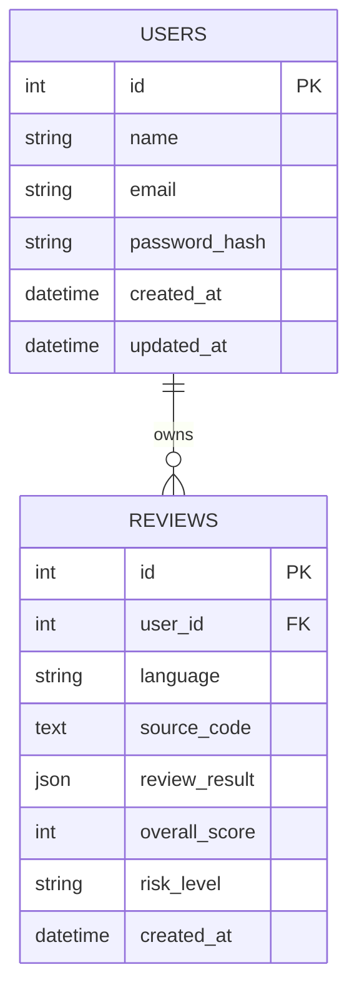
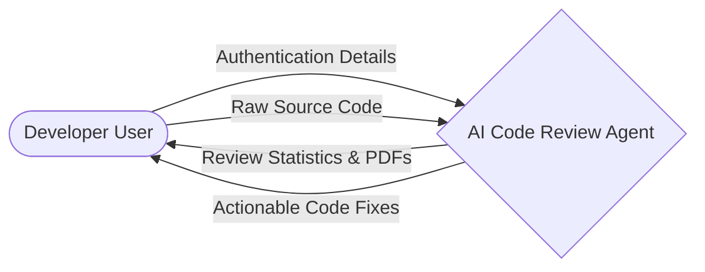
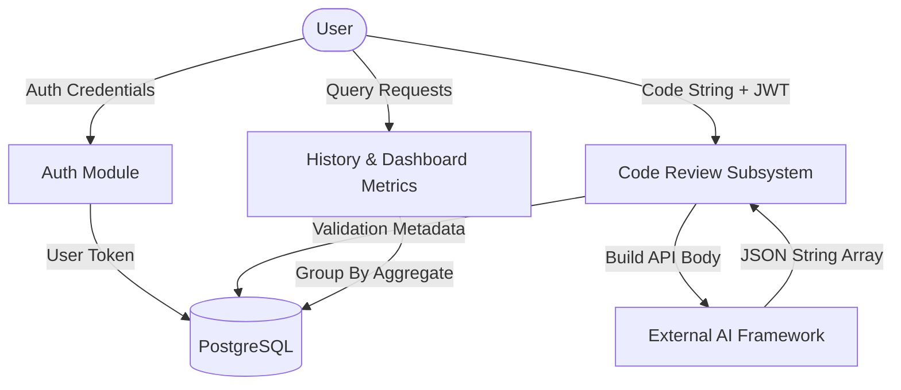

# AI Code Review Agent - Complete Project Report

## 1. Abstract
The "AI Code Review Agent" is an intelligent, scalable web application designed to automate and enhance the process of software code review. Leveraging highly capable Large Language Models (LLMs) via the OpenRouter API (specifically DeepSeek V3), the system evaluates source code for bugs, security vulnerabilities, algorithmic complexities, and stylistic inconsistencies. The platform provides a rich user dashboard mapping dynamic reviews, automated code corrections, and complex scoring metrics in real-time, thereby expediting secure software deployment cycles.

## 2. Introduction
Code reviews are a fundamental bottleneck in the software development lifecycle (SDLC). Traditional peer reviews are prone to human error, time-constraints, and inconsistent auditing mechanisms. The AI Code Review Agent resolves this by introducing a robust, artificial intelligence-powered automation layer capable of reading syntax across major programming languages (Java, Python, C++, etc.), and outputting exact JSON structures delineating risk assessments.

## 3. Problem Statement
Development teams consistently lack the required human resources to perform deep, strict static and dynamic code analyses on every commit independently. Manual review creates excessive developer cycle times. Developers need a tool that can instantly provide unbiased, deeply technical root-cause analysis, optimize algorithmic performance, and guarantee continuous security tracking without drastically altering their toolchains.

## 4. Objectives
- Formulate a seamless API layout allowing developers to input raw source code in natively supported languages.
- Translate code schemas securely into AI-ready prompt contexts optimizing tokens properly mapped to OpenRouter integration schemas.
- Build persistent database models tracking metric variances over time allowing developer teams to review their progress/history natively.
- Export advanced review records autonomously via PDF and JSON exports.

## 5. Technology Stack
- **Frontend**: React.js, Vite, TailwindCSS, Monaco Editor, Lucide React, Axios.
- **Backend**: Python 3, FastAPI, SQLAlchemy, Alembic, Uvicorn, Python-Jose (JWT JWTs), passlib.
- **Database**: PostgreSQL
- **AI/LLM Engine**: OpenRouter integration routing to `deepseek/deepseek-chat-v3-0324`.
- **Infrastructure**: Vercel (Frontend), Render (Backend/PostgreSQL).

## 6. System Architecture

## 7. Workflow Diagram

## 8. ER Diagram

## 9. DFD Level 0

## 10. DFD Level 1

## 11. API Documentation
- **`POST /api/v1/auth/register`**: Accepts `name`, `email`, `password`. Hashes and inserts user.
- **`POST /api/v1/auth/login`**: Accepts login dict, issues JWT access token.
- **`POST /api/v1/review/analyze`**: Protected. Evaluates code through OpenRouter, commits to DB, returning full structured AI results.
- **`GET /api/v1/history`**: Protected. Returns array list mapping all previous reports corresponding selectively to token's `user_id`.
- **`GET /api/v1/dashboard/stats`**: Protected. Returns grouped metric totals scaling risk aggregations natively.
- **`GET /api/v1/report/pdf/{id}`**: Resolves native downloadable PDF.

## 12. Testing Strategy
- **Unit Testing**: PyTest configurations isolating token hashing strategies, endpoint protection checks seamlessly.
- **Integration Testing**: Faking OpenRouter payload integrations ensuring schema constraints correctly default under bad JSON triggers.
- **Frontend Testing**: React Testing Library verifying strict DOM configurations across CodeEditor contexts ensuring `monaco-editor` parses standard inputs appropriately.

## 13. Future Enhancements
- Deep GitHub App integration tracking Pull Request pushes seamlessly checking them in real-time natively bypassing the UI string inputs.
- Agentic Action pipelines that commit the "Corrected Code" output directly back toward the user's remote repository.
- Automated code complexity scanning running independently of AI.

## 14. Conclusion
The AI Code Review Agent introduces powerful next-generation static capabilities efficiently bridged via standard cloud-web infrastructure. Scaling OpenAI/DeepSeek models to enforce semantic context drastically reduces logical issues slipping to production, ultimately empowering enterprise-scale workflows inside an accessible developer-friendly ecosystem.
